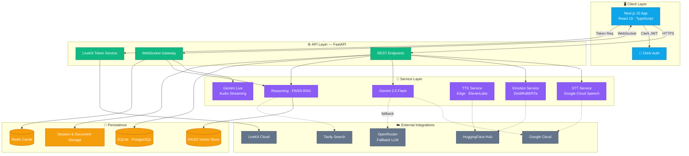
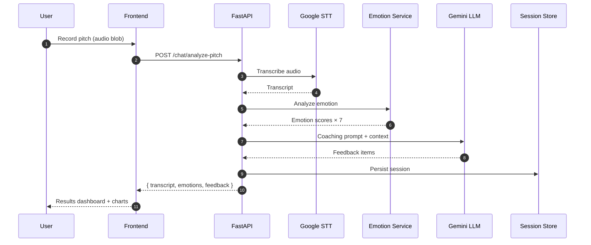
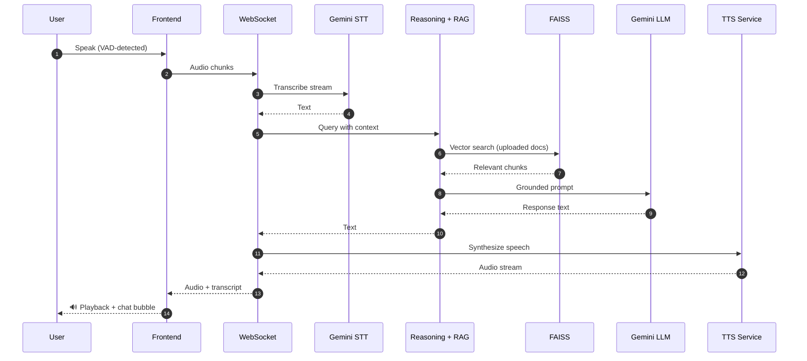
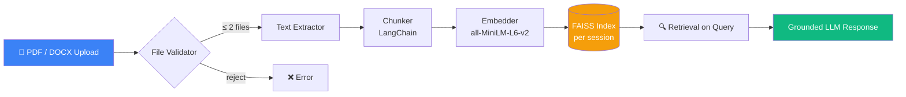

<div align="center">

# Pitchex

### AI-Powered Pitch & Negotiation Coaching Platform

*Practice, analyze, and perfect your pitch with real-time AI feedback.*

[](https://nextjs.org/)
[](https://react.dev/)
[](https://fastapi.tiangolo.com/)
[](https://www.python.org/)
[](https://www.typescriptlang.org/)
[](https://tailwindcss.com/)
[](https://ai.google.dev/)
[](https://livekit.io/)
[](LICENSE)

[Features](#-features) · [Architecture](#-architecture) · [Quick Start](#-quick-start) · [API Reference](#-api-reference) · [Roadmap](#-roadmap)

</div>

---

## 📖 Overview

**Pitchex** is a full-stack AI coaching platform that helps entrepreneurs, sales professionals, and presenters sharpen their pitches. It pairs a sleek Next.js interface with a FastAPI backend powered by Google Gemini, LiveKit, and a local RAG pipeline — enabling users to *record*, *stream live*, or *interactively converse* with an AI coach that understands their business context.

The system transcribes speech, detects emotion, scores delivery, and generates tailored coaching — all in real time.

<div align="center">

> *"From nervous first draft to investor-ready pitch — without ever leaving your browser."*

</div>

---

## ✨ Features

<table>
<tr>
<td width="50%" valign="top">

### 🎙️ Recorded Pitch Sessions
Record a pitch up to 5 minutes. Get automatic transcription, emotion sentiment breakdown, and detailed AI coaching feedback.

### 🔴 Live Coaching (Gemini Live)
Real-time bidirectional audio streaming with Google's Gemini Live API over WebSockets. The coach hears you, reasons, and responds on the fly.

### 💬 Interactive Voice Pitch
Full STT → RAG-reasoning → TTS loop. Speak naturally, and the coach replies with voice — backed by the documents you've uploaded.

### 📹 Video Room (LiveKit)
JWT-authenticated video rooms for face-to-face practice with an AI coach — WebRTC-grade quality with low latency.

</td>
<td width="50%" valign="top">

### 📄 Document Context (RAG)
Upload up to **2 PDFs/DOCX** per session. Parsed, embedded with sentence-transformers, and searched via FAISS for grounded responses.

### 📊 Rich Analysis Dashboard
7-dimension emotion tracking (nervousness, enthusiasm, confidence, etc.), performance radar charts, and transcript carousels.

### 🔐 Secure Authentication
Clerk-powered SSO with Google, GitHub, email-magic-links, and more.

### 💾 Session Memory
Every session is persisted — resume conversations, review history, and track improvement over time.

</td>
</tr>
</table>

---

## 🏛️ Architecture

### System Overview



### Recorded Pitch Flow



### Interactive Voice Pitch Flow



### Document Ingestion (RAG Pipeline)



---

## 🛠️ Tech Stack

<table>
<tr>
<th>Layer</th>
<th>Technologies</th>
</tr>
<tr>
<td><b>Frontend</b></td>
<td>Next.js 15 (App Router) · React 19 · TypeScript · Tailwind CSS 4 · shadcn/ui · Radix · Framer Motion · GSAP · Recharts · React Three Fiber</td>
</tr>
<tr>
<td><b>Backend</b></td>
<td>FastAPI · Uvicorn · Pydantic · SQLAlchemy (async) · Alembic</td>
</tr>
<tr>
<td><b>AI / ML</b></td>
<td>Google Gemini 2.5 Flash · Gemini Live · HuggingFace Transformers · sentence-transformers · FAISS · LangChain · PyTorch</td>
</tr>
<tr>
<td><b>Real-time</b></td>
<td>WebSockets · LiveKit (WebRTC) · VAD (voice activity detection)</td>
</tr>
<tr>
<td><b>Speech</b></td>
<td>Google Cloud Speech-to-Text · Edge TTS · ElevenLabs</td>
</tr>
<tr>
<td><b>Persistence</b></td>
<td>SQLite / PostgreSQL · Redis · FAISS vector store</td>
</tr>
<tr>
<td><b>Auth</b></td>
<td>Clerk (Google · GitHub · Magic Link SSO)</td>
</tr>
<tr>
<td><b>Tooling</b></td>
<td>Turbopack · ESLint · Bash orchestration scripts</td>
</tr>
</table>

---

## 📁 Project Structure

```
pitchex/
├── backend/                      # FastAPI application
│   ├── main.py                   # App entry — mounts routes, CORS, startup
│   ├── core/config.py            # Settings & env validation
│   ├── api/routes/               # REST + WebSocket endpoints
│   │   ├── analysis.py           # Pitch analysis w/ OpenRouter fallback
│   │   ├── chat.py               # End-to-end chat pipeline
│   │   ├── documents.py          # PDF/DOCX upload & context
│   │   ├── emotion.py            # Emotion classification
│   │   ├── live.py               # Gemini Live WebSocket
│   │   ├── live_pitch.py         # Interactive STT→Reason→TTS WS
│   │   ├── livekit_token.py      # WebRTC room tokens
│   │   ├── sessions.py           # Session CRUD
│   │   └── stt.py                # Speech-to-text
│   ├── services/                 # Business logic
│   │   ├── emotion_service.py
│   │   ├── gemini_service.py
│   │   ├── gemini_live_service.py
│   │   ├── stt_service.py
│   │   ├── tts_service.py
│   │   ├── context_service.py    # RAG ingestion
│   │   └── openrouter_service.py
│   ├── Reasoning/                # RAG + vector search module
│   ├── schemas/api_schemas.py    # Pydantic models
│   └── data/                     # Sessions & uploaded documents
│
├── frontend/                     # Next.js application
│   ├── app/                      # App Router pages
│   │   ├── page.tsx              # Landing page
│   │   ├── dashboard/            # Main app
│   │   ├── sign-in/ · sign-up/   # Clerk auth
│   │   └── help/                 # Help page
│   ├── components/
│   │   ├── recorded-session.tsx
│   │   ├── live-session-livekit.tsx
│   │   ├── live-session-websocket.tsx
│   │   ├── interactive-pitch-session.tsx
│   │   ├── results-page.tsx
│   │   ├── charts/               # Recharts visualizations
│   │   └── ui/                   # shadcn primitives
│   ├── features/                 # Feature-scoped modules
│   ├── hooks/                    # React hooks (audio, sessions, WS)
│   └── lib/api/client.ts         # Typed API client
│
├── commands/                     # Developer guides
├── logs/                         # Runtime logs
├── start-app.sh                  # One-shot backend + frontend
├── stop-app.sh                   # Graceful shutdown
└── status-app.sh                 # Health check
```

---

## 🚀 Quick Start

### Prerequisites

- **Python** ≥ 3.13
- **Node.js** ≥ 20
- **Redis** (optional — for caching)
- Accounts / API keys for: Google Cloud · Gemini · HuggingFace · Clerk · LiveKit *(required)*, ElevenLabs · OpenRouter · Tavily *(optional)*

### 1. Clone & Configure

```bash
git clone https://github.com/<your-username>/pitchex.git
cd pitchex
cp backend/.env.example .env
# Fill in your API keys — see Environment Variables below
```

### 2. One-Command Start (recommended)

```bash
./start-app.sh --install     # installs deps + starts both services
./status-app.sh              # check health
./stop-app.sh                # graceful shutdown
```

### 3. Manual Setup

<details>
<summary><b>Backend</b></summary>

```bash
cd backend
python -m venv venv
source venv/bin/activate
pip install -r requirements.txt
python main.py
# Serves → http://localhost:8000
# Docs   → http://localhost:8000/docs
```
</details>

<details>
<summary><b>Frontend</b></summary>

```bash
cd frontend
npm install
npm run dev
# Serves → http://localhost:3000
```
</details>

---

## 🔑 Environment Variables

Create a `.env` file at the project root:

| Variable | Required | Description |
|---|:---:|---|
| `GEMINI_API_KEY` | ✅ | Google Gemini API key (primary LLM) |
| `GOOGLE_APPLICATION_CREDENTIALS` | ✅ | Path to GCP service account JSON |
| `GOOGLE_CLOUD_PROJECT` | ✅ | GCP project ID |
| `HUGGINGFACE_API_KEY` | ✅ | HF token for emotion model |
| `CLERK_SECRET_KEY` | ✅ | Clerk backend secret |
| `NEXT_PUBLIC_CLERK_PUBLISHABLE_KEY` | ✅ | Clerk frontend key |
| `LIVEKIT_API_KEY` / `LIVEKIT_API_SECRET` / `LIVEKIT_URL` | ✅ | LiveKit credentials |
| `OPENROUTER_API_KEY` | ⬜ | OpenRouter fallback LLM |
| `ELEVEN_API_KEY` | ⬜ | ElevenLabs premium TTS |
| `TAVILY_API_KEY` | ⬜ | Web search for reasoning |
| `DATABASE_URL` | ⬜ | Defaults to `sqlite:///pitchex.db` |
| `REDIS_URL` | ⬜ | Defaults to `redis://localhost:6379/0` |
| `FRONTEND_URL` | ⬜ | CORS origin · default `http://localhost:3000` |
| `SECRET_KEY` | ✅ | JWT signing secret |
| `PORT` / `HOST` | ⬜ | Backend bind — defaults `8000` / `0.0.0.0` |

---

## 🔌 API Reference

Auto-generated OpenAPI docs are served at **`http://localhost:8000/docs`** (Swagger UI) and **`/redoc`**.

<details>
<summary><b>REST Endpoints</b></summary>

| Method | Path | Description |
|---|---|---|
| `GET`    | `/api/v1/health`                     | Service health check |
| `POST`   | `/api/v1/stt/transcribe`             | Transcribe uploaded audio |
| `POST`   | `/api/v1/emotion/analyze`            | Single-text emotion analysis |
| `POST`   | `/api/v1/emotion/batch`              | Batch emotion analysis |
| `POST`   | `/api/v1/llm/generate`               | LLM text generation |
| `GET`    | `/api/v1/llm/status`                 | LLM backend status |
| `POST`   | `/api/v1/chat/send`                  | Text chat + emotion |
| `POST`   | `/api/v1/chat/analyze-pitch`         | Full audio → coaching pipeline |
| `POST`   | `/api/v1/llm/analyze-pitch`          | Analyze pitch with doc context |
| `POST`   | `/api/v1/sessions`                   | Create session |
| `GET`    | `/api/v1/sessions/{user_id}`         | List user sessions |
| `GET`    | `/api/v1/sessions/{session_id}`      | Get session detail |
| `PATCH`  | `/api/v1/sessions/{session_id}`      | Update session |
| `DELETE` | `/api/v1/sessions/{session_id}`      | Delete session |
| `POST`   | `/api/v1/documents/upload`           | Upload PDF/DOCX (max 2) |
| `GET`    | `/api/v1/documents/context/{sid}`    | Retrieve session context |
| `DELETE` | `/api/v1/documents/{sid}/{idx}`      | Remove document |
| `POST`   | `/api/v1/reasoning/query`            | RAG query against vector store |
| `GET`    | `/api/v1/live/token`                 | Mint LiveKit room token |

</details>

<details>
<summary><b>WebSocket Endpoints</b></summary>

| Path | Description |
|---|---|
| `WS /api/v1/ws/live/{session_id}`        | Gemini Live bidirectional audio |
| `WS /api/v1/ws/interactive/{session_id}` | STT → Reason → TTS loop |

</details>

---

## 🧭 Usage Walkthrough

1. **Sign up** via Clerk (Google / GitHub / email magic link).
2. Land on the **Dashboard** — see your past sessions and improvement trajectory.
3. Open the **Mode Selection Modal** and pick one:
   - 🎙️ **Record** — fire-and-forget pitch review
   - 🔴 **Live (Gemini)** — real-time conversational coaching
   - 💬 **Interactive** — speak to an AI coach with doc-grounded RAG
   - 📹 **Video Room** — WebRTC coaching with full video presence
4. *(Optional)* Upload up to 2 PDFs for context-aware feedback.
5. Finish the session → view the **Analysis Carousel**: transcript, emotion radar, per-slide coaching notes.

---

## 🗺️ Roadmap

- [ ] Multi-language pitch coaching (ES, FR, DE, HI)
- [ ] Team workspaces with shared session libraries
- [ ] Pitch deck (PPT) parsing & slide-by-slide feedback
- [ ] Persistent user progress dashboard with trend analytics
- [ ] Mobile-first PWA with offline recording
- [ ] Investor-simulation mode with adversarial Q&A
- [ ] Self-hosted Docker Compose stack
- [ ] Fine-tuned domain coaches (sales / fundraising / interview)

---

## 🤝 Contributing

Contributions are welcome. Please open an issue first to discuss substantial changes.

```bash
# Fork, then
git checkout -b feat/your-feature
# Commit with clear messages
git commit -m "feat: add investor simulation mode"
git push origin feat/your-feature
# Open a PR against main
```

Consult the guides under [`commands/`](commands/) for setup, style, and debugging references.

---

## 📄 License

Released under the [MIT License](LICENSE).

---

## 🙏 Acknowledgments

Built on the shoulders of giants:

- [**Google Gemini**](https://ai.google.dev/) · conversational intelligence
- [**LiveKit**](https://livekit.io/) · real-time infrastructure
- [**HuggingFace**](https://huggingface.co/) · emotion & embedding models
- [**Clerk**](https://clerk.com/) · authentication
- [**shadcn/ui**](https://ui.shadcn.com/) · beautiful component primitives
- [**FastAPI**](https://fastapi.tiangolo.com/) · blazing-fast Python API framework
- [**Next.js**](https://nextjs.org/) · React framework with App Router

---

<div align="center">

**Built with curiosity by [AlphaAhmad](https://github.com/AlphaAhmad)**

*If Pitchex helped you nail a pitch, give it a ⭐ — it truly helps.*

</div>

# Pitchex AI Coach

## 🚀 Python Backend for AI Pitching & Negotiation Coach

This is the FastAPI backend that powers the Pitchex AI Coach platform. It integrates:
- **Google Speech-to-Text** for audio transcription
- **Gemini 2.5 Pro** for intelligent coaching responses
- **Emotion Detection** using HuggingFace transformers
- **Real-time Analysis Pipeline** for comprehensive pitch feedback

---

## 📋 Features

### ✅ Implemented (Phase 1-3)
- [x] FastAPI backend with async support
- [x] Google STT integration (with mock fallback for development)
- [x] Gemini 2.5 Pro LLM integration
- [x] Emotion detection (7 emotions + metrics)
- [x] Combined chat endpoint (text → emotion → LLM)
- [x] Complete pitch analysis (audio → STT → emotion → LLM)
- [x] RESTful API with proper error handling
- [x] Structured logging
- [x] CORS configuration for frontend

### 🎯 Architecture

```
┌─────────────────┐
│  Frontend       │
│  (Next.js)      │
└────────┬────────┘
         │
         │ HTTP/WebSocket
         ▼
┌─────────────────┐
│  FastAPI        │
│  API Gateway    │
└────────┬────────┘
         │
    ┌────┴────┬────────┬────────┐
    ▼         ▼        ▼        ▼
┌────────┐ ┌────────┐ ┌────────┐ ┌────────┐
│  STT   │ │Emotion │ │Gemini  │ │  DB    │
│Service │ │Service │ │Service │ │        │
└────────┘ └────────┘ └────────┘ └────────┘
```

---

## 🛠️ Installation & Setup

### 1. Create Virtual Environment
```bash
cd backend
python -m venv venv
source venv/bin/activate  # On Windows: venv\Scripts\activate
```

### 2. Install Dependencies
```bash
pip install -r requirements.txt
```

### 3. Environment Variables
The `.env` file is already configured with your API keys. No changes needed for development.

### 4. Run the Server
```bash
python main.py
```

Or using uvicorn directly:
```bash
uvicorn main:app --reload --host 0.0.0.0 --port 8000
```

The API will be available at: `http://localhost:8000`

---

## 📚 API Documentation

Once the server is running, visit:
- **Swagger UI**: http://localhost:8000/docs
- **ReDoc**: http://localhost:8000/redoc

### Key Endpoints

#### 1. Health Check
```bash
GET /api/v1/health
```

#### 2. Emotion Analysis
```bash
POST /api/v1/emotion/analyze
Content-Type: application/json

{
  "text": "I'm so excited about this amazing opportunity!",
  "session_id": "optional-session-id",
  "include_confidence": true
}
```

#### 3. Chat (Text → Emotion → LLM)
```bash
POST /api/v1/chat/send
Content-Type: application/json

{
  "message": "I believe our product will revolutionize the market",
  "session_id": "session-123",
  "include_emotion_analysis": true
}
```

#### 4. Complete Pitch Analysis (Audio → STT → Emotion → LLM)
```bash
POST /api/v1/chat/analyze-pitch
Content-Type: multipart/form-data

file: <audio-file.wav>
session_id: session-123
language_code: en-US
```

#### 5. STT Transcription
```bash
POST /api/v1/stt/transcribe
Content-Type: multipart/form-data

file: <audio-file.wav>
language_code: en-US
sample_rate: 16000
encoding: LINEAR16
```

---

## 🧪 Testing

### Test Emotion Analysis
```bash
curl -X POST "http://localhost:8000/api/v1/emotion/analyze" \
  -H "Content-Type: application/json" \
  -d '{
    "text": "I am incredibly confident that we will succeed!",
    "include_confidence": true
  }'
```

### Test Chat
```bash
curl -X POST "http://localhost:8000/api/v1/chat/send" \
  -H "Content-Type: application/json" \
  -d '{
    "message": "How can I improve my pitch delivery?",
    "include_emotion_analysis": true
  }'
```

---

## 🏗️ Project Structure

```
backend/
├── main.py                 # FastAPI application entry point
├── config.py              # Configuration and settings
├── requirements.txt       # Python dependencies
├── .env                   # Environment variables
│
├── api/
│   └── routes/           # API route handlers
│       ├── health.py     # Health check
│       ├── emotion.py    # Emotion analysis endpoints
│       ├── stt.py        # Speech-to-text endpoints
│       ├── llm.py        # LLM endpoints
│       └── chat.py       # Combined chat & pitch analysis
│
├── services/             # Business logic services
│   ├── emotion_service.py    # Emotion detection using HuggingFace
│   ├── gemini_service.py     # Gemini 2.5 Pro integration
│   └── stt_service.py        # Google Cloud STT integration
│
└── schemas/              # Pydantic models
    └── api_schemas.py    # Request/response schemas
```

---

## 🎯 Service Details

### Emotion Detection Service
- **Model**: `j-hartmann/emotion-english-distilroberta-base`
- **Emotions**: anger, disgust, fear, joy, neutral, sadness, surprise
- **Metrics**: 
  - Nervousness score & level
  - Enthusiasm score & level
  - Confidence score & level
  - Emotional stability

### Gemini LLM Service
- **Model**: `gemini-2.0-flash-exp` (latest Gemini model)
- **Features**: 
  - Emotion-aware coaching responses
  - Conversation history management
  - Customizable coaching persona
  - Fallback responses for errors

### STT Service
- **Provider**: Google Cloud Speech-to-Text
- **Features**: 
  - Multiple audio format support (WAV, MP3, FLAC, OGG)
  - Automatic punctuation
  - Mock mode for development without credentials
  - Confidence scoring

---

## 🔧 Development Notes

### Mock Mode
If you don't have Google Cloud credentials configured, the STT service runs in **mock mode** and returns a sample transcription. This allows you to develop and test the emotion and LLM pipeline without Google Cloud setup.

### Emotion Model Download
On first run, the emotion detection model (~250MB) will be automatically downloaded from HuggingFace. This may take a few minutes.

### Performance
- Emotion analysis: ~50-100ms (CPU)
- LLM response: ~1-3s
- STT transcription: ~500ms-2s (depends on audio length)

---

## 🚀 Next Steps

1. **Test the API** using the Swagger UI or curl commands
2. **Integrate with frontend** (Next.js React components)
3. **Add TTS** (Phase 5) for voice responses
4. **Add session management** and user progress tracking
5. **Deploy** to cloud (AWS, GCP, Azure)

---

## 📝 Environment Variables

| Variable | Description | Default |
|----------|-------------|---------|
| `GEMINI_API_KEY` | Google Gemini API key | Required |
| `HUGGINGFACE_API_KEY` | HuggingFace API key | Optional |
| `GOOGLE_CLOUD_PROJECT` | Google Cloud project ID | Optional |
| `DATABASE_URL` | Database connection string | SQLite |
| `PORT` | Server port | 8000 |
| `DEBUG` | Enable debug mode | True |
| `FRONTEND_URL` | Frontend URL for CORS | http://localhost:3000 |

---

## 🤝 Contributing

This is a comprehensive backend implementation following best practices:
- ✅ Async/await for better performance
- ✅ Proper error handling and logging
- ✅ Pydantic validation for all requests
- ✅ Modular service architecture
- ✅ Singleton pattern for service instances
- ✅ CORS configuration
- ✅ Structured logging

---

## 📄 License

Part of the Pitchex FYP Project - 2025
