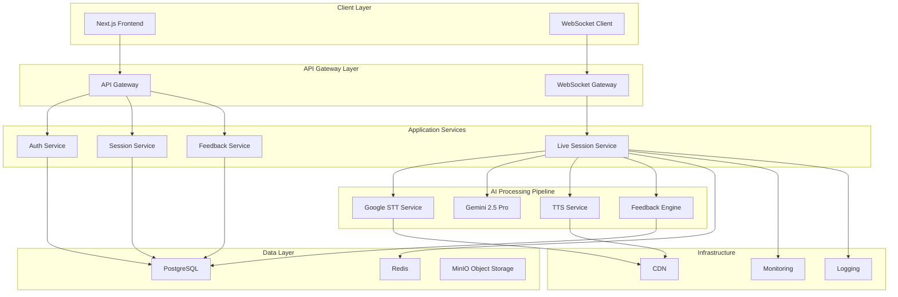
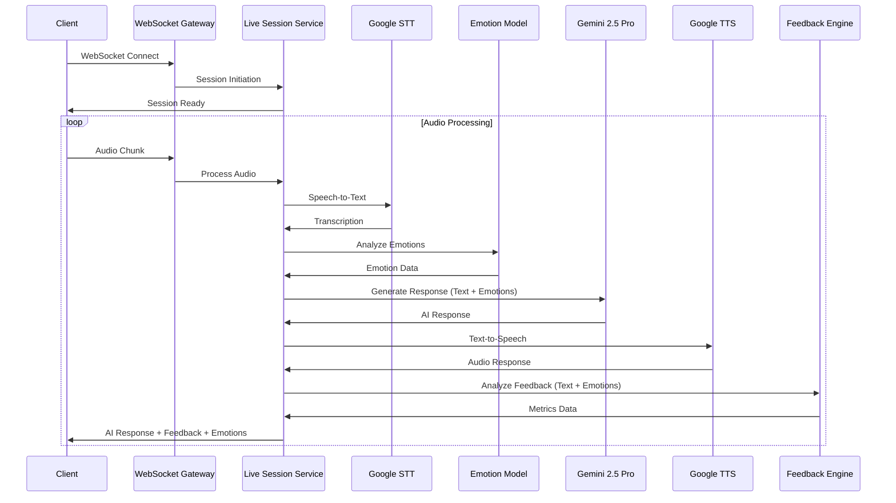
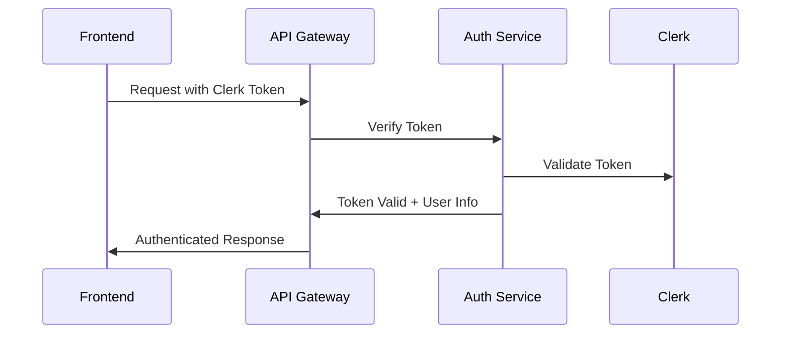

# AI Pitching & Negotiation Coach - Backend Architecture Specification

## Executive Summary

This document provides a comprehensive technical specification for the backend architecture of the AI Pitching & Negotiation Coach system. The architecture is designed to support real-time audio processing, intelligent coaching responses, session management, and analytics while maintaining scalability, security, and performance.

## 1. System Architecture Overview

### 1.1 High-Level Architecture



### 1.2 Core Components

#### 1.2.1 Real-time Audio Processing Pipeline
- **Speech-to-Text (STT)**: Google Cloud Speech-to-Text API for real-time transcription
- **Emotion Detection**: HuggingFace transformer model for emotion analysis from text
- **Language Model**: Gemini 2.5 Pro for intelligent negotiation coaching with emotion-aware responses
- **Text-to-Speech (TTS)**: Google Cloud Text-to-Speech API for AI responses
- **Audio Streaming**: WebSocket-based real-time communication

**Pipeline Flow:**
1. Audio → STT → Transcribed Text
2. Transcribed Text → Emotion Detection → Emotional Analysis
3. Text + Emotions → LLM → Context-Aware Response
4. Response → TTS → Audio Output

#### 1.2.2 Session Management
- **Session Lifecycle**: Create, start, pause, resume, and complete negotiation sessions
- **User Progress**: Track skill development and improvement over time
- **Recording**: Store session recordings for later analysis

#### 1.2.3 Feedback Engine
- **Emotion Analysis**: Multi-class emotion detection (joy, sadness, anger, fear, surprise, neutral, confidence)
- **Sentiment Analysis**: Real-time sentiment detection during conversations (positive, negative, neutral)
- **Persuasion Scoring**: Evaluate argument strength and persuasiveness
- **Clarity Assessment**: Measure speech clarity and articulation
- **Confidence Metrics**: Analyze speaking confidence and tone
- **Emotional Intelligence**: Track emotional awareness and regulation during pitch

## 2. Technology Stack

### 2.1 Core Technologies

| Component | Technology | Purpose |
|-----------|------------|---------|
| **Backend Framework** | Python FastAPI | High-performance API server with async support |
| **Real-time Communication** | WebSocket (FastAPI) | WebSocket implementation |
| **Emotion Detection** | HuggingFace Transformers | Text emotion analysis model |
| **Database** | PostgreSQL 15 | Primary data storage |
| **Cache** | Redis 7 | Session caching and rate limiting |
| **Object Storage** | MinIO | Audio file storage |
| **Message Queue** | RabbitMQ | Asynchronous processing |
| **AI Services** | Google Cloud APIs + Gemini | STT, TTS, and LLM integration |
| **Authentication** | Clerk Integration | User authentication and authorization |

### 2.2 Development Tools

- **API Documentation**: Swagger/OpenAPI
- **Testing**: Jest + Supertest
- **Code Quality**: ESLint + Prettier
- **Containerization**: Docker + Docker Compose
- **Orchestration**: Kubernetes (for production)

## 3. API Endpoint Structure

### 3.1 Authentication Endpoints

```
POST /api/auth/signin
POST /api/auth/signup
POST /api/auth/verify
POST /api/auth/refresh
GET /api/auth/me
```

### 3.2 Session Management Endpoints

```
POST /api/sessions
GET /api/sessions
GET /api/sessions/:sessionId
PUT /api/sessions/:sessionId
DELETE /api/sessions/:sessionId
POST /api/sessions/:sessionId/start
POST /api/sessions/:sessionId/pause
POST /api/sessions/:sessionId/resume
POST /api/sessions/:sessionId/complete
```

### 3.3 Live Session Endpoints (WebSocket)

```
WebSocket /ws/session/:sessionId
  - Message: audio_chunk
  - Message: text_input
  - Message: session_control
  - Response: transcription
  - Response: ai_response
  - Response: feedback_metrics
```

### 3.4 Analytics Endpoints

```
GET /api/analytics/skills
GET /api/analytics/progress
GET /api/analytics/sessions
GET /api/analytics/feedback
GET /api/analytics/recommendations
```

### 3.5 Content Management Endpoints

```
GET /api/scenarios
GET /api/scenarios/:scenarioId
POST /api/scenarios
PUT /api/scenarios/:scenarioId
GET /api/feedback-templates
POST /api/feedback-templates
```

## 4. Database Schema Design

### 4.1 Core Tables

#### Users Table
```sql
CREATE TABLE users (
    id UUID PRIMARY KEY DEFAULT gen_random_uuid(),
    clerk_id VARCHAR(255) UNIQUE NOT NULL,
    email VARCHAR(255) UNIQUE NOT NULL,
    first_name VARCHAR(100),
    last_name VARCHAR(100),
    avatar_url VARCHAR(500),
    created_at TIMESTAMP WITH TIME ZONE DEFAULT NOW(),
    updated_at TIMESTAMP WITH TIME ZONE DEFAULT NOW()
);
```

#### Sessions Table
```sql
CREATE TABLE sessions (
    id UUID PRIMARY KEY DEFAULT gen_random_uuid(),
    user_id UUID REFERENCES users(id),
    scenario_id UUID REFERENCES scenarios(id),
    status VARCHAR(50) NOT NULL DEFAULT 'created',
    started_at TIMESTAMP WITH TIME ZONE,
    completed_at TIMESTAMP WITH TIME ZONE,
    duration INTEGER,
    created_at TIMESTAMP WITH TIME ZONE DEFAULT NOW(),
    updated_at TIMESTAMP WITH TIME ZONE DEFAULT NOW()
);
```

#### Session Recordings Table
```sql
CREATE TABLE session_recordings (
    id UUID PRIMARY KEY DEFAULT gen_random_uuid(),
    session_id UUID REFERENCES sessions(id),
    audio_url VARCHAR(500) NOT NULL,
    transcription_url VARCHAR(500),
    created_at TIMESTAMP WITH TIME ZONE DEFAULT NOW()
);
```

#### Feedback Metrics Table
```sql
CREATE TABLE feedback_metrics (
    id UUID PRIMARY KEY DEFAULT gen_random_uuid(),
    session_id UUID REFERENCES sessions(id),
    timestamp TIMESTAMP WITH TIME ZONE NOT NULL,
    sentiment_score DECIMAL(3,2),
    clarity_score DECIMAL(3,2),
    confidence_score DECIMAL(3,2),
    persuasion_score DECIMAL(3,2),
    speaking_rate DECIMAL(5,2),
    filler_word_count INTEGER,
    created_at TIMESTAMP WITH TIME ZONE DEFAULT NOW()
);
```

#### Scenarios Table
```sql
CREATE TABLE scenarios (
    id UUID PRIMARY KEY DEFAULT gen_random_uuid(),
    title VARCHAR(255) NOT NULL,
    description TEXT,
    difficulty_level VARCHAR(50),
    category VARCHAR(100),
    script JSONB,
    expected_duration INTEGER,
    created_at TIMESTAMP WITH TIME ZONE DEFAULT NOW(),
    updated_at TIMESTAMP WITH TIME ZONE DEFAULT NOW()
);
```

### 4.2 Indexes for Performance

```sql
CREATE INDEX idx_sessions_user_id ON sessions(user_id);
CREATE INDEX idx_sessions_status ON sessions(status);
CREATE INDEX idx_sessions_created_at ON sessions(created_at);
CREATE INDEX idx_feedback_metrics_session_id ON feedback_metrics(session_id);
CREATE INDEX idx_feedback_metrics_timestamp ON feedback_metrics(timestamp);
CREATE INDEX idx_scenarios_category ON scenarios(category);
CREATE INDEX idx_scenarios_difficulty ON scenarios(difficulty_level);
```

## 5. Real-time Audio Processing Pipeline

### 5.1 Audio Flow Architecture



### 5.2 Audio Processing Configuration

#### STT Configuration
- **Sample Rate**: 16 kHz
- **Audio Encoding**: LINEAR16
- **Language**: en-US
- **Alternative Language Hints**: en-GB, en-AU
- **Enable Automatic Punctuation**: true
- **Enable Word Time Offsets**: true

#### TTS Configuration
- **Voice Selection**: voices/en-US-Neural2-J (professional, clear)
- **Audio Encoding**: MP3
- **Speaking Rate**: 1.0 (normal)
- **Pitch**: 0.0 (normal)
- **Volume Gain**: 0.0 dB

#### LLM Configuration
- **Model**: gemini-2.5-pro
- **Temperature**: 0.7 (balanced creativity)
- **Top P**: 0.9
- **Top K**: 40
- **Max Tokens**: 2048
- **Safety Settings**: BLOCK_MEDIUM_AND_ABOVE

#### Emotion Detection Configuration
- **Model**: j-hartmann/emotion-english-distilroberta-base (HuggingFace)
- **Emotions Detected**: anger, disgust, fear, joy, neutral, sadness, surprise
- **Additional Metrics**: confidence, nervousness, enthusiasm
- **Processing**: Real-time text-based emotion classification
- **Threshold**: 0.6 (minimum confidence score)
- **Fallback**: neutral (if confidence < threshold)

**Emotion Model Details:**
- **Architecture**: DistilRoBERTa fine-tuned on emotion detection
- **Input**: Transcribed text chunks
- **Output**: Multi-class emotion probabilities + dominant emotion
- **Integration**: Runs in parallel with LLM processing
- **Purpose**: Provides emotional context to LLM for empathetic responses

## 6. Authentication and Security

### 6.1 Authentication Flow



### 6.2 API Security
- **Rate Limiting**: Prevent abuse with configurable rate limits
- **CORS**: Proper CORS configuration for frontend access
- **Input Validation**: Strict input validation on all endpoints
- **SQL Injection Prevention**: Parameterized queries with SQLAlchemy
- **XSS Protection**: Sanitize all user inputs

---

## 7. Implementation Phases

### Phase 1: Backend Setup & STT Integration ✅

**Objectives:**
- Set up robust FastAPI project structure
- Implement Google Speech-to-Text service
- Create RESTful API endpoints for audio transcription
- Test STT functionality with various audio formats

**Deliverables:**
1. ✅ FastAPI application with modular structure
2. ✅ Google Cloud STT integration
3. ✅ `/api/v1/stt/transcribe` endpoint
4. ✅ Error handling and logging
5. ✅ Unit tests for STT service

**Technical Details:**
- Google Cloud Speech-to-Text API v1
- Support for streaming and batch transcription
- Audio format support: WAV, MP3, FLAC, OGG
- Real-time transcription with interim results

---

### Phase 2: LLM Integration ✅

**Objectives:**
- Implement Gemini 2.5 Pro service with reasoning capabilities
- Create intelligent chat API endpoints
- Add conversation context management
- Test LLM responses for coaching quality

**Deliverables:**
1. ✅ Gemini 2.5 Pro API integration
2. ✅ `/api/v1/chat/send` endpoint
3. ✅ Conversation history management
4. ✅ Context-aware response generation
5. ✅ System prompts for negotiation coaching

**Technical Details:**
- Gemini 2.5 Pro API with thinking/reasoning mode
- Session-based context management
- Configurable temperature and token limits
- Multi-turn conversation support
- Coaching persona implementation

---

### Phase 2.5: Emotion Detection Integration 🆕

**Objectives:**
- Integrate emotion analysis model for pitch emotional intelligence
- Detect emotions from transcribed text in real-time
- Provide emotional context to LLM for empathetic coaching
- Track emotional patterns throughout pitch sessions

**Deliverables:**
1. 🎯 HuggingFace emotion detection model integration
2. 🎯 `/api/v1/emotion/analyze` endpoint
3. 🎯 Real-time emotion analysis from transcribed text
4. 🎯 Emotion-aware LLM prompt enhancement
5. 🎯 Emotion metrics and tracking
6. 🎯 Emotional intelligence scoring

**Technical Details:**

**Model Selection:**
```python
# Primary: j-hartmann/emotion-english-distilroberta-base
# Emotions: anger, disgust, fear, joy, neutral, sadness, surprise
# Accuracy: ~66% on GoEmotions dataset
# Speed: ~50ms inference time on CPU

# Alternative: bhadresh-savani/distilbert-base-uncased-emotion
# For comparison and fallback
```

**API Endpoint Specification:**
```python
POST /api/v1/emotion/analyze
Request:
{
    "text": "I believe this product will revolutionize the market!",
    "session_id": "uuid",
    "include_confidence": true
}

Response:
{
    "dominant_emotion": "joy",
    "emotions": {
        "anger": 0.02,
        "disgust": 0.01,
        "fear": 0.05,
        "joy": 0.78,
        "neutral": 0.08,
        "sadness": 0.03,
        "surprise": 0.03
    },
    "confidence": 0.78,
    "metrics": {
        "enthusiasm_level": "high",
        "confidence_indicator": "strong",
        "nervousness_score": 0.05
    },
    "timestamp": "2025-11-05T10:30:00Z"
}
```

**Integration with LLM Pipeline:**
```python
# Enhanced pipeline flow:
# 1. Audio → STT → Transcribed Text
# 2. Transcribed Text → Emotion Model → Emotional Analysis
# 3. Text + Emotions → Enhanced Prompt → Gemini 2.5 Pro
# 4. LLM generates emotion-aware coaching response

# Example enhanced prompt:
"""
User's pitch: "{transcribed_text}"
Detected emotions: {dominant_emotion} (confidence: {confidence})
Emotional tone: {enthusiasm_level}, nervousness: {nervousness_score}

As a pitch coach, provide feedback that:
1. Acknowledges their emotional state
2. Addresses nervousness if detected
3. Reinforces confidence when present
4. Suggests emotional adjustments for better delivery
"""
```

**Emotion Tracking Features:**
- Real-time emotion timeline during pitch
- Emotion transition analysis (e.g., nervous → confident)
- Peak emotional moments detection
- Emotional consistency scoring
- Comparison with successful pitch patterns

**Performance Optimization:**
- Model caching with 4-hour TTL
- Batch processing for historical analysis
- Async inference for non-blocking operations
- CPU-optimized inference (DistilRoBERTa)

---

### Phase 3: Frontend Integration (STT + LLM + Emotion) ✅

**Objectives:**
- Create comprehensive API client in Next.js frontend
- Build audio recording and playback components
- Implement STT → Emotion Detection → LLM pipeline UI
- Display real-time emotion analysis
- Test complete end-to-end flow

**Deliverables:**
1. ✅ API client service (`/lib/api/client.ts`)
2. ✅ Audio recording component with visualization
3. ✅ Real-time transcription display
4. 🎯 Emotion indicator component (new)
5. 🎯 Emotion timeline visualization (new)
6. ✅ Chat interface with coaching responses
7. ✅ Error handling and loading states
8. 🎯 Emotion-aware UI feedback (new)

**New Frontend Components:**

**1. Emotion Indicator Component:**
```typescript
// components/EmotionIndicator.tsx
interface EmotionData {
  dominant: string;
  confidence: number;
  emotions: Record<string, number>;
}

// Real-time emotion badge with color coding
// joy: green, fear/nervous: yellow, anger: red, neutral: gray
```

**2. Emotion Timeline:**
```typescript
// components/EmotionTimeline.tsx
// Visual timeline showing emotion changes during pitch
// Similar to audio waveform but with emotion colors
// Helps users see emotional patterns
```

**3. Emotional Intelligence Dashboard:**
```typescript
// components/EmotionalIntelligenceDashboard.tsx
// Post-pitch analytics showing:
// - Emotion distribution chart
// - Confidence trends
// - Nervousness peaks
// - Improvement suggestions
```

**API Integration:**
```typescript
// lib/api/emotion.ts
export async function analyzeEmotion(text: string, sessionId: string) {
  return apiClient.post('/emotion/analyze', { text, session_id: sessionId });
}

// Real-time emotion tracking during recording
onTranscriptUpdate(async (transcript) => {
  const emotion = await analyzeEmotion(transcript, sessionId);
  updateEmotionIndicator(emotion);
});
```

---

### Phase 4: Advanced Emotion Features & Analytics 🔮

**Objectives:**
- Implement emotion-based coaching recommendations
- Build emotion pattern recognition
- Create personalized emotional improvement plans
- Add comparative emotion analysis

**Deliverables:**
1. 🔮 Emotion pattern recognition engine
2. 🔮 Personalized emotion coaching
3. 🔮 Historical emotion trend analysis
4. 🔮 Benchmark against successful pitches
5. 🔮 Emotion-triggered coaching interventions

**Advanced Features:**

**1. Emotion Pattern Recognition:**
```python
# Detect common emotional patterns:
- "Nervous start, confident finish" → Positive growth
- "Confident throughout" → Strong delivery
- "Inconsistent emotions" → Needs stability work
- "High fear/anxiety" → Stress management needed
```

**2. Real-time Coaching Interventions:**
```python
# Trigger coaching based on emotions:
if nervousness_score > 0.7:
    send_coaching_tip("Take a deep breath. Slow down your pace.")
    
if confidence_score < 0.3:
    send_coaching_tip("Speak with more conviction. Stand tall.")
    
if anger_detected:
    send_coaching_tip("Stay calm. Reframe your point positively.")
```

**3. Emotion-Based Success Metrics:**
- Optimal emotion profile for pitch success
- Emotion stability score
- Emotional adaptability rating
- Confidence growth trajectory

---

### Phase 5: TTS Integration 🔮

**Objectives:**
- Implement Text-to-Speech service for AI coach voice
- Create natural-sounding coaching responses
- Add real-time streaming capabilities
- Support multiple voice profiles

**Deliverables:**
1. 🔮 Google Cloud TTS integration
2. 🔮 `/api/v1/tts/synthesize` endpoint
3. 🔮 Real-time audio streaming
4. 🔮 Voice customization options
5. 🔮 Audio caching for common responses

**Technical Details:**
- Google Cloud Text-to-Speech API
- Neural2 voices for natural delivery
- Streaming synthesis for low latency
- SSML support for prosody control
- Emotion-adaptive voice modulation

---

## 8. Current Implementation Status

### ✅ Completed
- [x] FastAPI backend structure
- [x] Google STT integration
- [x] Gemini 2.5 Pro LLM integration
- [x] Basic chat endpoints
- [x] Frontend API client
- [x] Audio recording component
- [x] Real-time transcription UI

### 🎯 In Progress (Phase 2.5)
- [ ] Emotion detection model integration
- [ ] Emotion API endpoints
- [ ] Emotion-aware LLM prompts
- [ ] Emotion indicator UI
- [ ] Emotion timeline visualization

### 🔮 Planned
- [ ] Advanced emotion analytics
- [ ] Emotion pattern recognition
- [ ] TTS integration
- [ ] Full session management
- [ ] User progress tracking
- [ ] Comprehensive analytics dashboard

---

## 9. Emotion Detection Implementation Guide

### Step 1: Install Dependencies
```bash
cd backend
pip install transformers torch sentencepiece protobuf
```

### Step 2: Create Emotion Service
```python
# services/emotion_service.py
from transformers import pipeline
import torch

class EmotionService:
    def __init__(self):
        self.classifier = pipeline(
            "text-classification",
            model="j-hartmann/emotion-english-distilroberta-base",
            top_k=None,
            device=0 if torch.cuda.is_available() else -1
        )
    
    def analyze(self, text: str) -> dict:
        results = self.classifier(text)[0]
        emotions = {r['label']: r['score'] for r in results}
        dominant = max(emotions, key=emotions.get)
        
        return {
            "dominant_emotion": dominant,
            "emotions": emotions,
            "confidence": emotions[dominant],
            "metrics": self._calculate_metrics(emotions)
        }
    
    def _calculate_metrics(self, emotions: dict) -> dict:
        nervousness = emotions.get('fear', 0) + emotions.get('sadness', 0)
        enthusiasm = emotions.get('joy', 0) + emotions.get('surprise', 0)
        confidence_indicator = emotions.get('neutral', 0) + enthusiasm
        
        return {
            "nervousness_score": nervousness,
            "enthusiasm_level": "high" if enthusiasm > 0.5 else "medium" if enthusiasm > 0.3 else "low",
            "confidence_indicator": "strong" if confidence_indicator > 0.6 else "moderate" if confidence_indicator > 0.4 else "weak"
        }
```

### Step 3: Create API Endpoint
```python
# api/routes/emotion.py
from fastapi import APIRouter, HTTPException
from pydantic import BaseModel

router = APIRouter(prefix="/emotion", tags=["emotion"])

class EmotionRequest(BaseModel):
    text: str
    session_id: str
    include_confidence: bool = True

@router.post("/analyze")
async def analyze_emotion(request: EmotionRequest):
    try:
        emotion_service = get_emotion_service()
        result = emotion_service.analyze(request.text)
        result["session_id"] = request.session_id
        result["timestamp"] = datetime.utcnow().isoformat()
        return result
    except Exception as e:
        raise HTTPException(status_code=500, detail=str(e))
```

### Step 4: Integrate with LLM Pipeline
```python
# Enhanced chat endpoint
@router.post("/chat/send")
async def send_message(request: ChatRequest):
    # 1. Get transcription
    transcript = request.message
    
    # 2. Analyze emotion
    emotion_result = emotion_service.analyze(transcript)
    
    # 3. Create emotion-aware prompt
    enhanced_prompt = f"""
    User's pitch: "{transcript}"
    
    Emotional Analysis:
    - Dominant emotion: {emotion_result['dominant_emotion']}
    - Confidence: {emotion_result['confidence']:.2f}
    - Nervousness: {emotion_result['metrics']['nervousness_score']:.2f}
    - Enthusiasm: {emotion_result['metrics']['enthusiasm_level']}
    
    Provide coaching feedback that addresses their emotional state.
    """
    
    # 4. Get LLM response
    response = await gemini_service.generate(enhanced_prompt)
    
    return {
        "response": response,
        "emotion_analysis": emotion_result
    }
```

---

## 10. Testing Strategy

### Emotion Detection Tests
```python
# tests/test_emotion_service.py
def test_joy_detection():
    text = "I'm so excited about this amazing opportunity!"
    result = emotion_service.analyze(text)
    assert result['dominant_emotion'] == 'joy'
    assert result['confidence'] > 0.5

def test_nervousness_detection():
    text = "I'm worried this might not work out..."
    result = emotion_service.analyze(text)
    assert result['metrics']['nervousness_score'] > 0.5

def test_confidence_detection():
    text = "We will definitely achieve our goals and exceed expectations."
    result = emotion_service.analyze(text)
    assert result['metrics']['confidence_indicator'] == 'strong'
```

---

## 11. Next Steps

1. **Immediate (Week 1):**
   - ✅ Implement emotion detection service
   - ✅ Create emotion API endpoints
   - ✅ Add emotion analysis to chat pipeline
   - ✅ Build basic emotion UI indicators

2. **Short-term (Week 2-3):**
   - 🎯 Emotion timeline visualization
   - 🎯 Emotion-aware coaching prompts
   - 🎯 Emotion tracking in sessions
   - 🎯 Basic emotion analytics

3. **Medium-term (Month 2):**
   - 🔮 Advanced emotion pattern recognition
   - 🔮 Personalized emotion coaching
   - 🔮 TTS integration with emotion modulation
   - 🔮 Comprehensive analytics dashboard

---

**Document Version:** 2.0  
**Last Updated:** November 5, 2025  
**Status:** Phase 2.5 (Emotion Detection) - Ready for Implementation
